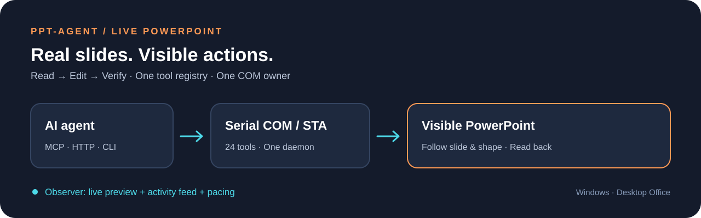
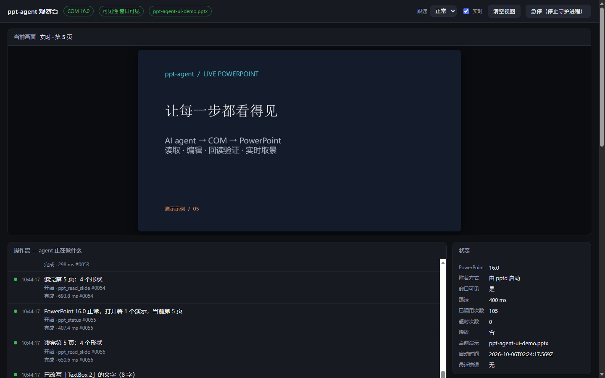
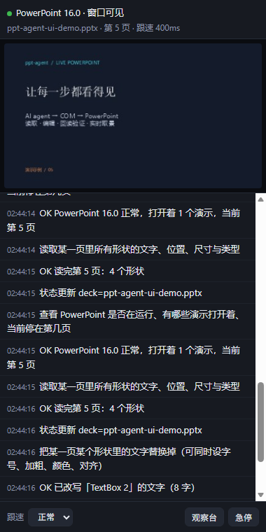

<p align="center"></p>
<h1 align="center">ppt-agent</h1>
<p align="center"><strong>让 agent 操作真实 PowerPoint，让每一步都看得见。</strong></p>
<p align="center">实时读取与编辑 · 可见窗口 · 操作流水 · MCP / HTTP / CLI</p>
<p align="center"><strong>简体中文</strong> · <a href="README.en.md">English</a></p>
<p align="center">
  <a href="https://github.com/Curlance/ppt-agent/actions/workflows/ci.yml"></a>
  
  
  
  <a href="LICENSE"></a>
</p>
<p align="center"><a href="#功能">功能</a> · <a href="#快速开始">快速开始</a> · <a href="#实际界面">实际界面</a> · <a href="#接入-agent">接入 agent</a> · <a href="#验证与边界">验证与边界</a></p>

<picture>
  <source media="(max-width: 680px)" srcset="assets/workflow-mobile.svg" />
  
</picture>

ppt-agent 是 Windows 上的 PowerPoint 实时控制工具。Agent 可以读取当前打开的演示、修改文字与形状、编辑备注和表格单元格，并通过回读与截图检查结果。操作发生在桌面版 PowerPoint 中：编辑自动跟到目标页和形状，浏览器观察台同步显示画面与中文操作流水。

> **当前状态：开发中的可用核心。** 本机已验证真实 PowerPoint 的读取、编辑、保存、实时取景及 MCP 接入。PowerPoint 内加载项和 DSH 状态条仍需安装与端到端验收；详细记录见 [交付报告](交付报告.md)。

## 功能

| 能力 | 已实现的行为 |
|---|---|
| 读取演示 | 列出演示与页面，读取文字、备注、形状、表格正文和组合子形状 |
| 实时编辑 | 改文字和格式、调整位置、添加文本框和图片、编辑备注与表格单元格 |
| 管理页面 | 新增、复制、删除、跳转页面，编辑时自动显示目标页和形状 |
| 文件操作 | 打开、新建、保存、另存备份、关闭指定演示 |
| 操作可见 | PowerPoint 窗口可见，实时取景、中文操作流水、跟速控制和停止入口 |
| Agent 接口 | 24 个工具由同一注册表生成 MCP、HTTP/OpenAPI 和 CLI 契约 |
| 串行 COM | 独立 STA 线程、单一守护进程、参数校验、写入不自动重放 |

## 快速开始

需要 **Windows、Python 3.11+、已安装并可启动的桌面版 Microsoft PowerPoint**。本机验收环境为 Python 3.13 与 PowerPoint 16.0。网页版 PowerPoint 不提供本项目使用的 COM 接口。

在 PowerShell 中执行（示例使用 Python 3.13，可以换为自己安装的受支持版本）：

```powershell
git clone https://github.com/Curlance/ppt-agent.git
cd ppt-agent
py -3.13 -m venv .venv
.venv\Scripts\python.exe -m pip install -e ".[dev]"

.venv\Scripts\python.exe -m pptd doctor
.venv\Scripts\python.exe -m pptd url --launch
```

`doctor` 会检查解释器和 COM，必要时启动守护进程。`url --launch` 打开带本机令牌的观察台。接着打开自己的演示：

```powershell
.venv\Scripts\python.exe -m pptd open "C:\path\to\demo.pptx"
.venv\Scripts\python.exe -m pptd call ppt_read_slide -a slide=1
.venv\Scripts\python.exe -m pptd call ppt_shot -a slide=1
.venv\Scripts\python.exe -m pptd call ppt_set_pace -a pace_ms=800
```

读取结果包含形状序号和 `ref`。使用返回的标识编辑，并回读检查：

```powershell
# shape 必须替换为读取结果中的实际形状标识
.venv\Scripts\python.exe -m pptd call ppt_set_text -a slide=1 -a shape=1 -a text="新的标题"
.venv\Scripts\python.exe -m pptd call ppt_read_slide -a slide=1
```

查看全部工具：`.venv\Scripts\python.exe -m pptd tools`。需要结束会话时执行 `.venv\Scripts\python.exe -m pptd stop`，守护进程停止后 PowerPoint 保持打开。

## 实际界面

以下为真实浏览器渲染截图，画面中的 PPT 是测试自动创建的示例演示。

**观察台**：当前页实时取景、PowerPoint 状态、工具列表和操作流水。



**窄任务窗格页面**：实时画面、跟速与停止按钮。此截图是在浏览器中验证的页面，PowerPoint 内旁加载仍待验收。

<p align="center"></p>

## 接入 agent

安装完成后，环境内提供 `pptctl` 命令；也可以始终用 `.venv\Scripts\python.exe -m pptd` 调用。

| 接入方式 | 入口 | 使用方式 |
|---|---|---|
| MCP stdio | `python -m pptd mcp` | 在本机 MCP 客户端配置解释器、工作目录与参数 |
| MCP HTTP | `http://127.0.0.1:8792/mcp` | 支持 Streamable HTTP 的客户端，携带令牌 |
| HTTP / OpenAPI | `http://127.0.0.1:8791` | `/tools/<工具名>` 或 `/call` 调用 |
| CLI | `pptctl call <工具名>` | 脚本、终端及本机 agent |

这些入口复用同一个守护进程。操作令牌保存在 `%LOCALAPPDATA%\ppt-agent\runtime.json`，运行 `pptctl url --mcp-token` 可查看；配置或截图中不要公开令牌。

完整说明见 [接入指南](docs/api/CONNECT.md)、[工具参考](docs/api/tools.md) 和 [OpenAPI](docs/api/openapi.json)。公开指南使用占位路径，可为本机生成配置：

```powershell
.venv\Scripts\python.exe -m pptd export-api --local-paths --out local-docs
```

可选集成：

- **DSH**：`pptctl dsh-bundle` 生成含本机路径的 bundle，`pptctl dsh-status` 检查安装与加载状态。
- **Agent 技能**：[skills/ppt-agent](skills/ppt-agent/SKILL.md) 描述读取、编辑、回读和错误恢复流程；`pptctl skill-install` 默认安装到 DSH 技能目录，其他宿主可用 `--out` 指定目录。
- **PowerPoint 内界面**：[加载项说明](addin/README.md) 提供 VBA 浮窗和 Web Add-in 的安装步骤；安装与信任设置需自行完成。

## 验证与边界

```powershell
# 常规测试：不启动真实 PowerPoint
.venv\Scripts\python.exe -m pytest -q
.venv\Scripts\python.exe -m pptd export-api --check

# 真机测试：会启动 PowerPoint 并创建临时演示
.venv\Scripts\python.exe -m pytest -m com -q
```

CI 在 Windows 上检查单元测试、接口文档和打包；CI 环境没有桌面 Office，真机 COM 与 UI 验收在本机单独运行。测试记录与具体覆盖范围见 [交付报告](交付报告.md)。

| 当前边界 | 说明 |
|---|---|
| Office / 宿主加载项 | 已提供源码、配置和页面，实际宿主内的加载与交互仍待验收 |
| 图表、动画与母版 | 图表仅读取类型和标题，完整数据编辑、任意动画与母版设计尚未提供 |
| 超时后的写入 | 正在执行的 COM 调用无法强制撤回；先检查演示现状，再决定下一步 |
| 回退与备份 | PowerPoint 决定撤销粒度；批量删除或大改前先 `ppt_save(mode="copy")` |
| 环境覆盖 | 本机验证不代表所有 Office 版本和安装环境均已验收 |

## 项目结构

```text
pptd/               守护进程、STA COM、注册表、工具与三种接口
addin/              VBA 源码、Web Add-in 清单与安装说明
skills/ppt-agent/   Agent 的操作与验证规则
docs/api/           自动生成的契约和接入指南
docs/screenshots/   自建示例演示的真实 UI 截图
assets/             Logo 与流程图
tests/              单元测试、真机 COM 和浏览器测试
```

[设计背景](项目介绍.md) 保留早期设计，完成情况以当前 README 和交付报告为准。运行记录、令牌、私钥、本机路径配置、备份与构建产物均不纳入仓库。

项目采用 [MIT License](LICENSE)。Logo 的设计说明和生成提示词见 [品牌说明](assets/BRAND.md)。本项目与 Microsoft 无官方关联。
